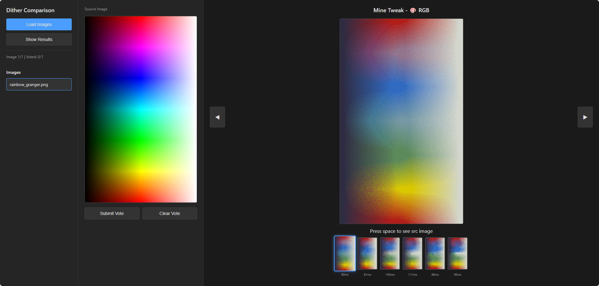

# E-Ink Dithering Tester

A browser-based tool to compare different image dithering algorithms using an e-ink style palette.

Load your own images, see multiple dithering outputs side-by-side, and vote on which algorithm looks best.

It's especially useful when testing:
- CIELAB vs RGB dithering
- Diferent palettes quantization
- Different error diffusion matrices
- Perceptual color handling
- etc.

## ✨ Features

- Multiple dithering algorithms (RGB, CIELAB, epdoptimize)
- Side-by-side dithering comparison
- Dithered image voting system to determine best algorithm

## 🚀 Installation

Clone the repository:

```bash
git clone https://github.com/mattcarter11/eink-dithering-tester.git
cd eink-dithering-tester
```

Install dependencies:

```bash
npm install
```

Run: 
```bash
npm run dev
```

The page reload automatically on code change.

## 🖼 How to Use

The tool has three sections:
- The left column has the buttons for loading the images, seeing the voting results and listing the images loaded.
- Next to it there's the currently viewing/voting image view.
- The right column has the dithering results view. Where we have a carousel of all the results for that image, the time they took to process and the currently viewing result.



### Shorcuts:
- Up / Down arrows to change selected image
- Left / Right arrow keys to switch the algorithm result view
- Spacebar to show the original image in the algorithm result view
- Press number keys (1–9) to jump directly to an algorithm result view
- Enter / Supr to add or remove the vote

### Viewing

- Click "Load Images" and select the images you want to compare.
- Comapre dithering results.

### Votting
- Go image by image, voting for the best algorithm. (change your vote anytime)
- Click "Show Results" to see a summary of vote counts across all tested images.
- Quickly identify which algorithm performs best overall.