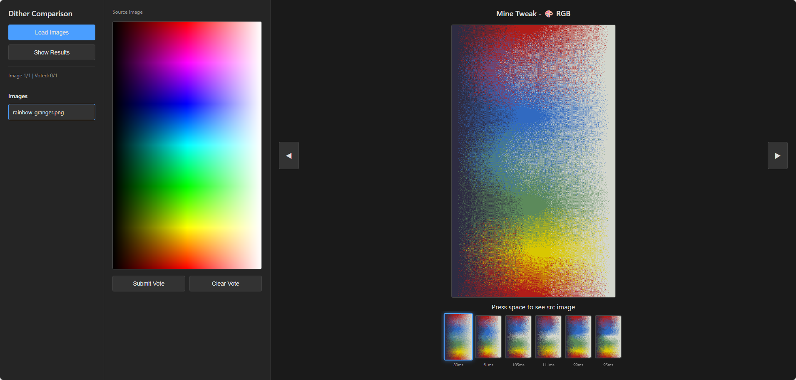

# E-Ink Dithering Tester

A browser-based tool to compare different image dithering algorithms using an e-ink style palette.

Load your own images, see multiple dithering outputs side-by-side, and vote on which algorithm looks best.

Useful when testing:
- RGB vs CIELAB dithering
- Diferent palettes quantization
- Different error diffusion matrices
- Perceptual color handling
- etc.

## ✨ Features

- Side-by-side dithering comparison
- Dithered image voting system to determine best algorithm
- Out of the box dithering algorithms:
    - Floyd in RGB color space
    - Floyd in CEILAB color space
    - Floyd in CEILAB color space but erro difusion on RGB
- Out of the box palettes:
    - Pure RGB
    - Wenting
    - Full (Wenting + RGB)

## 🚀 Installation

Clone the repository:

```bash
git clone https://github.com/mattcarter11/eink-dithering-tester.git
cd eink-dithering-tester
```

Install dependencies:

```bash
npm install
```

Run: 
```bash
npm run dev
```

The page reload automatically on code change.

## 🖼 How to Use

The tool has three sections:
- The left column has the buttons for loading the images, seeing the voting results and listing the images loaded.
- Next to it there's the currently viewing/voting image view.
- The right column has the dithering results view. Where we have a carousel of all the results for that image, the time they took to process and the currently viewing result.



### Shorcut

Key      | Usage      | Description
---------|------------|------------------------
↑/↓      | Navigation | Navigate between images
←/→      | Navigation | Cycle through dithering algorithms
1–9      | Navigation | Jump directly to algorithm by number
Escape   | Naviation  | Close modal
Space    | Viewing    | Hold to view source image
a/A      | Viewing    | Show in gammut palette pixels
s/S      | Viewing    | Show un smoothed dithered image
d/D      | Viewing    | Flat map to closest palette colors (without dithering)
e/E      | Viewing    | Show edge detection (laplacian)
Enter    | Votting    | Submit vote for current algorithm
Delete   | Votting    | Clear vote for current image

### Viewing

- Click "Load Images" and select the images you want to compare.
- Comapre dithering results.

### Votting
- Go image by image, voting for the best algorithm. (change your vote anytime)
- Click "Show Results" to see a summary of vote counts across all tested images.
- Quickly identify which algorithm performs best overall.

### Adding palettes / algorithms

**Palette**
- Add the palette in *src/config.js*
- Use it in the `algorithms` const in *src/config.js*

**Algorithms**
- Implement a new algorithm in *src/algorithms*
- Use it in the `algorithms` const in *src/config.js*
